# Hi, I'm Sayed Risat 👋

<picture>
  <source media="(prefers-color-scheme: dark)" srcset="./assets/hero-dark.svg">
  <source media="(prefers-color-scheme: light)" srcset="./assets/hero-light.svg">
  
</picture>

<p align="center">
  <a href="https://linkedin.com/in/risatseo">
    
  </a>
  <a href="mailto:sayedrisat.dm@gmail.com">
    
  </a>
  <a href="https://instagram.com/sayed_risat">
    
  </a>
  <a href="https://x.com/sayed_risat">
    
  </a>
  <a href="https://facebook.com/risatseo">
    
  </a>
  <a href="https://youtube.com/@UCjhfZ6Dz0x3-FxK6udzEu6w">
    
  </a>
</p>

---

## `> whoami`

```typescript
const sayedRisat = {
  role: "Full Stack Developer & Digital Strategist",
  location: "Chattogram, Bangladesh 🇧🇩",
  ventures: ["Lit Fusion", "AUREM", "Skivia"],
  focus: ["Full-Stack Products", "Automation", "SaaS"],
  currentStage: "Frontend complete — backend development in progress",
  philosophy: "Build with intent. Ship with purpose.",
};
```

I build full-stack products, automation tools, and SaaS applications—primarily for my own ventures and clients at **Lit Fusion**. I began with Meta Ads and marketing funnels, then started building the tools I wished already existed.

> I combine product thinking, development, and digital strategy to turn real workflow problems into useful software.

---

## `> tech_stack --list`

### Frontend

<p>
        
</p>

### Backend — currently building

<p>
      
</p>

### Cloud, DevOps & Tools

<p>
         
</p>

### Exploring next

<p>
      
</p>

`Next.js` · `TypeScript` · `Node.js` · `Java` · `MongoDB` · `Redis` · `Docker`

---

## `> roadmap --active`

- **Backend:** Node.js, Express, MVC, REST APIs, middleware, uploads, JWT/OAuth/RBAC, WebSockets, Redis, testing, and logging
- **Production:** Docker, CI/CD, Linux, AWS, security, observability, load balancing, and scalable stateless systems
- **AI engineering:** LLM fundamentals, structured output, tool calling, embeddings, RAG, LangChain, and multi-agent patterns
- **Computer science:** DSA, OOP, SOLID, design patterns, system design, and distributed-systems fundamentals

---

## `> status --current`

| | Focus |
|---|---|
| 🔨 **Working on** | Full-stack web apps and automation tools for Lit Fusion—dashboards, scrapers, and Chrome extensions |
| ✅ **Completed** | Frontend foundation and core frontend learning roadmap |
| ⚙️ **In progress** | Backend development with Node.js, Express, MongoDB, authentication, and APIs |
| 🤝 **Collaborate** | Next.js/React SaaS, marketer-focused dev tools, browser extensions, and open source |
| 📚 **Learning** | Backend engineering, system design, Docker, AWS, ML pipelines, and LangChain |
| 💬 **Ask me about** | Full-stack development, Chrome extensions, Meta Ads funnels, or shipping solo |

---

## `> ventures --list`

| Venture | What I do |
|---|---|
| **Lit Fusion** | Agency work, full-stack products, marketing systems, and internal automation |
| **AUREM** | Clothing venture |
| **Skivia** | Creative studio |

---

## `> github --stats`

<div align="center">
  
  <br>
  <picture>
    <source media="(prefers-color-scheme: dark)" srcset="https://github-readme-stats.vercel.app/api?username=sayedrisat&show_icons=true&hide_border=true&title_color=22D3EE&icon_color=A78BFA&text_color=94A3B8&bg_color=0A101F">
    
  </picture>
  <picture>
    <source media="(prefers-color-scheme: dark)" srcset="https://github-readme-stats.vercel.app/api/top-langs/?username=sayedrisat&layout=compact&langs_count=8&hide_border=true&title_color=22D3EE&text_color=94A3B8&bg_color=0A101F">
    
  </picture>
</div>

---

## `> contribution --snake`

<picture>
  <source media="(prefers-color-scheme: dark)" srcset="https://raw.githubusercontent.com/sayedrisat/sayedrisat/output/snake-dark.svg">
  <source media="(prefers-color-scheme: light)" srcset="https://raw.githubusercontent.com/sayedrisat/sayedrisat/output/snake-light.svg">
  
</picture>

---

## `> contact --me`

I'm open to meaningful collaborations, full-stack projects, automation work, and open-source opportunities.

<p align="center">
  <a href="https://linkedin.com/in/risatseo"></a>
  <a href="mailto:sayedrisat.dm@gmail.com"></a>
</p>

**Built with intent. Shipped with purpose.**<br>
`Chattogram, Bangladesh 🇧🇩`
